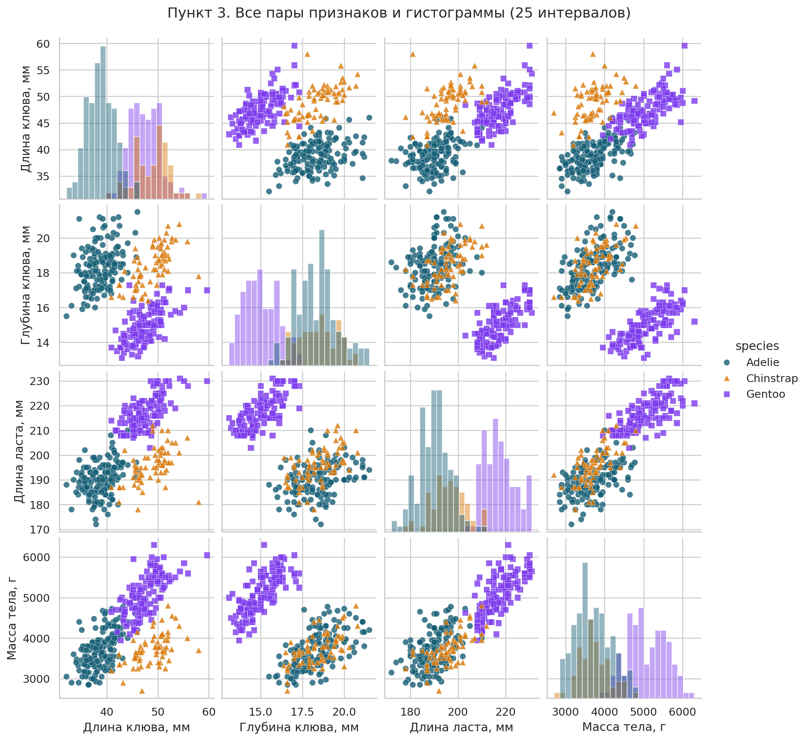
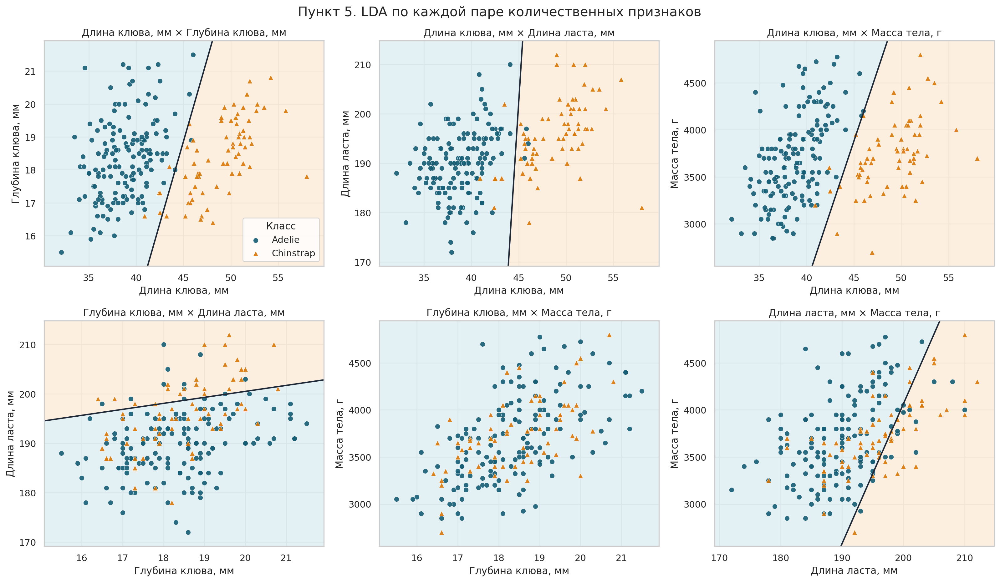
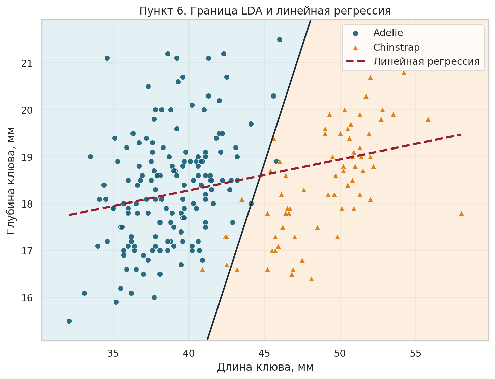
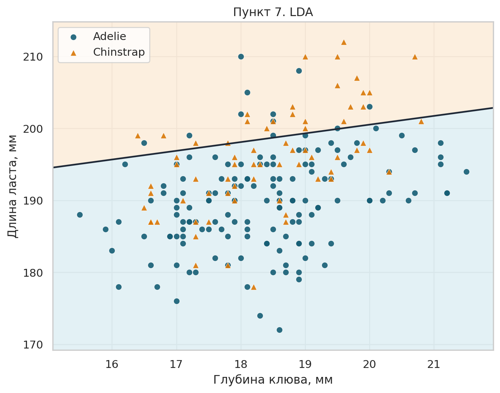
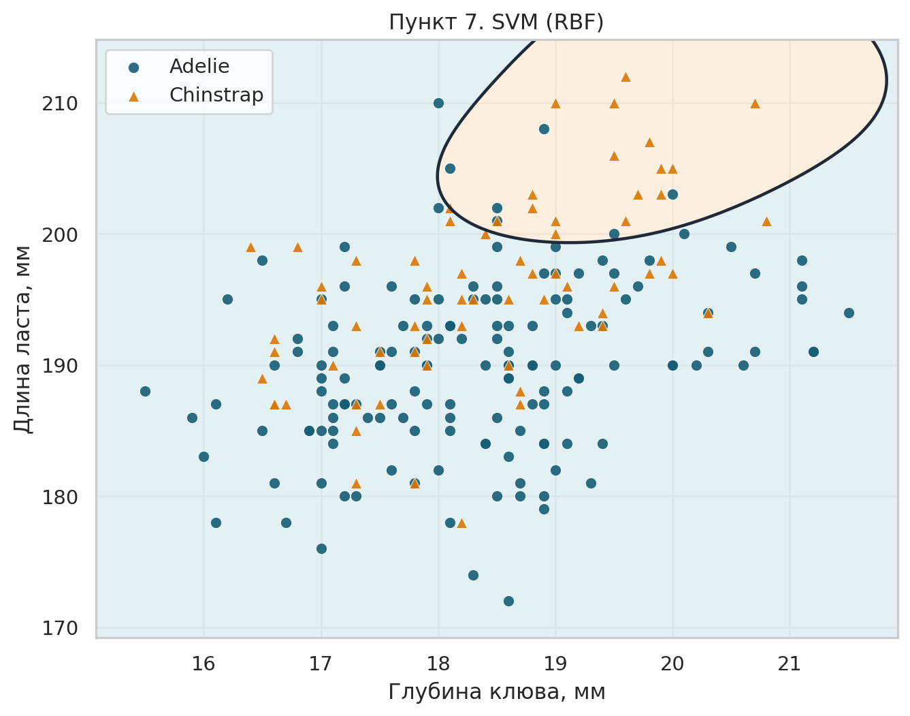
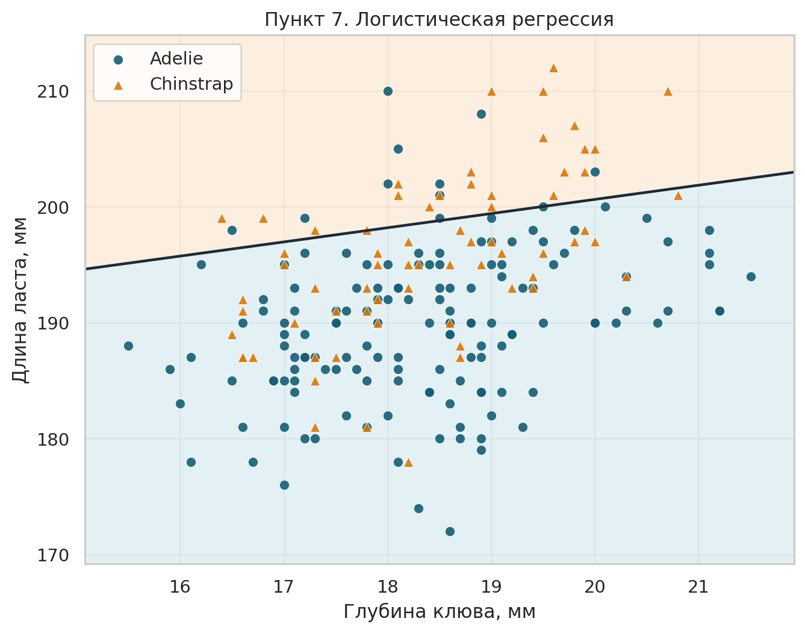
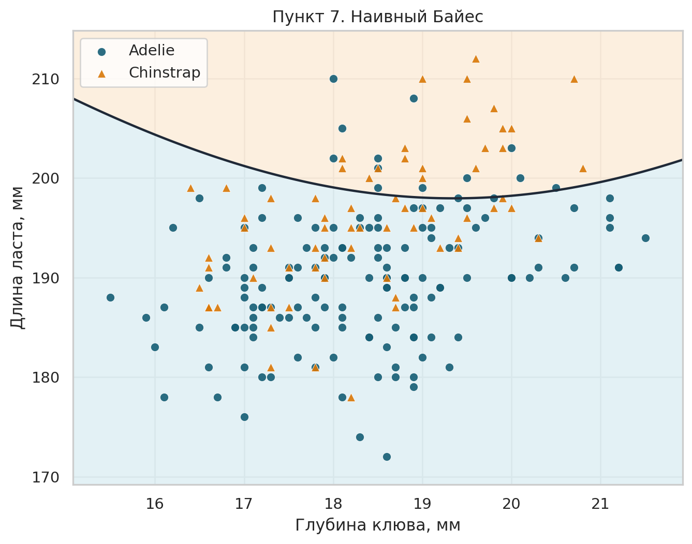
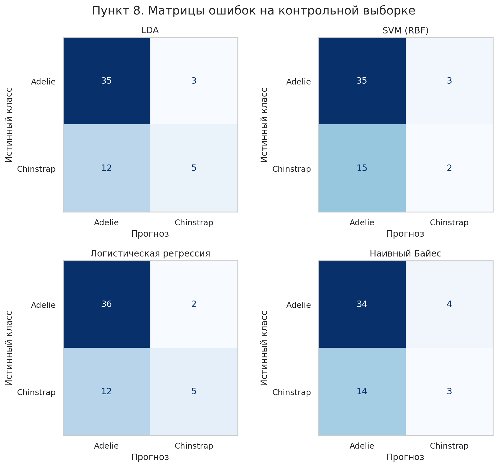
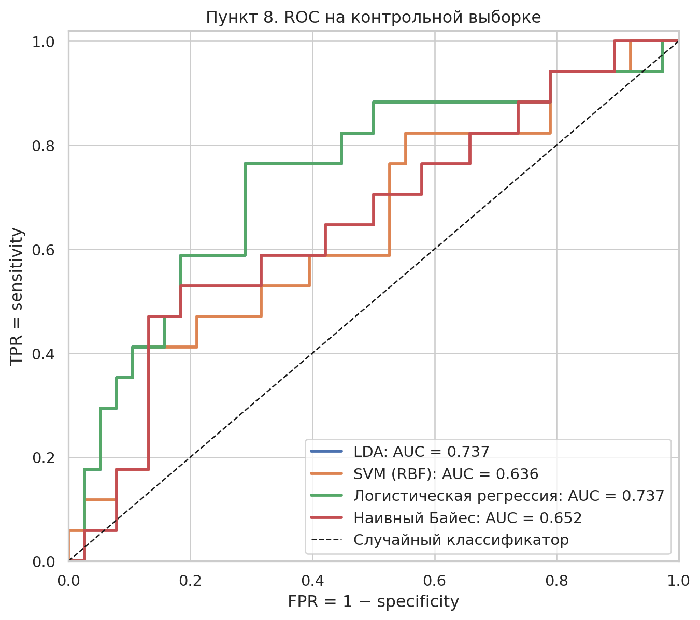

# Результаты задания 1

Источник: [palmerpenguins::penguins](https://github.com/allisonhorst/palmerpenguins/blob/main/inst/extdata/penguins.csv).
Цель — `species`; четыре признака указаны в именах столбцов и измеряются в мм или г.

## [2] Статистика и фильтрация

| Показатель                                           | Значение   |
|:-----------------------------------------------------|:-----------|
| Объектов до фильтрации                               | 344        |
| Столбцов исходной таблицы                            | 8          |
| Признаков без целевой переменной                     | 7          |
| Выбранных количественных признаков                   | 4          |
| Целевых классов                                      | 3          |
| Объектов с пропуском в любом признаке                | 11         |
| Доля объектов с пропуском в любом признаке, %        | 3.20       |
| Объектов с пропуском в выбранных 4 признаках         | 2          |
| Доля объектов с пропуском в выбранных 4 признаках, % | 0.58       |
| Объектов после фильтрации                            | 342        |
| Островов                                             | 3          |
| Начальный год                                        | 2007       |
| Конечный год                                         | 2009       |

### Число объектов по классам

| Класс     |   До фильтрации |   После фильтрации |
|:----------|----------------:|-------------------:|
| Adelie    |             152 |                151 |
| Chinstrap |              68 |                 68 |
| Gentoo    |             124 |                123 |

### Пропуски в исходных столбцах

| Столбец           |   Пропусков |   Доля, % |
|:------------------|------------:|----------:|
| species           |           0 |      0.00 |
| island            |           0 |      0.00 |
| bill_length_mm    |           2 |      0.58 |
| bill_depth_mm     |           2 |      0.58 |
| flipper_length_mm |           2 |      0.58 |
| body_mass_g       |           2 |      0.58 |
| sex               |          11 |      3.20 |
| year              |           0 |      0.00 |

Все пропуски четырёх измерений приходятся на два объекта. Они удалены, но объекты с неизвестным полом и заполненными измерениями сохранены: пол не участвует в анализе.

### Описательная статистика отфильтрованных измерений

| Признак           |   count |    mean |    std |   median |     min |     max |
|:------------------|--------:|--------:|-------:|---------:|--------:|--------:|
| bill_length_mm    |  342.00 |   43.92 |   5.46 |    44.45 |   32.10 |   59.60 |
| bill_depth_mm     |  342.00 |   17.15 |   1.97 |    17.30 |   13.10 |   21.50 |
| flipper_length_mm |  342.00 |  200.92 |  14.06 |   197.00 |  172.00 |  231.00 |
| body_mass_g       |  342.00 | 4201.75 | 801.95 |  4050.00 | 2700.00 | 6300.00 |

Отфильтрованные данные: [data/penguins_filtered.csv](data/penguins_filtered.csv).

## [3] Все пары признаков

На внедиагональных графиках классы различаются цветом и формой. На диагонали показаны гистограммы с 25 интервалами.

## [4] Корреляции Пирсона

Корреляции вычислены для всех 342 объектов с заполненными четырьмя измерениями, а затем отдельно внутри каждого вида. Коэффициент описывает линейную связь, а не причинную зависимость.

### Вся выборка

| Признак           |   bill_length_mm |   bill_depth_mm |   flipper_length_mm |   body_mass_g |
|:------------------|-----------------:|----------------:|--------------------:|--------------:|
| bill_length_mm    |            1.000 |          -0.235 |               0.656 |         0.595 |
| bill_depth_mm     |           -0.235 |           1.000 |              -0.584 |        -0.472 |
| flipper_length_mm |            0.656 |          -0.584 |               1.000 |         0.871 |
| body_mass_g       |            0.595 |          -0.472 |               0.871 |         1.000 |

### Adélie

| Признак           |   bill_length_mm |   bill_depth_mm |   flipper_length_mm |   body_mass_g |
|:------------------|-----------------:|----------------:|--------------------:|--------------:|
| bill_length_mm    |            1.000 |           0.391 |               0.326 |         0.549 |
| bill_depth_mm     |            0.391 |           1.000 |               0.308 |         0.576 |
| flipper_length_mm |            0.326 |           0.308 |               1.000 |         0.468 |
| body_mass_g       |            0.549 |           0.576 |               0.468 |         1.000 |

### Chinstrap

| Признак           |   bill_length_mm |   bill_depth_mm |   flipper_length_mm |   body_mass_g |
|:------------------|-----------------:|----------------:|--------------------:|--------------:|
| bill_length_mm    |            1.000 |           0.654 |               0.472 |         0.514 |
| bill_depth_mm     |            0.654 |           1.000 |               0.580 |         0.604 |
| flipper_length_mm |            0.472 |           0.580 |               1.000 |         0.642 |
| body_mass_g       |            0.514 |           0.604 |               0.642 |         1.000 |

### Gentoo

| Признак           |   bill_length_mm |   bill_depth_mm |   flipper_length_mm |   body_mass_g |
|:------------------|-----------------:|----------------:|--------------------:|--------------:|
| bill_length_mm    |            1.000 |           0.643 |               0.661 |         0.669 |
| bill_depth_mm     |            0.643 |           1.000 |               0.707 |         0.719 |
| flipper_length_mm |            0.661 |           0.707 |               1.000 |         0.703 |
| body_mass_g       |            0.669 |           0.719 |               0.703 |         1.000 |

**Как читать корреляции.** В общей выборке связь глубины клюва и массы тела отрицательна (r = -0.472), но внутри каждого вида положительна (Adélie 0.576; Chinstrap 0.604; Gentoo 0.719). Смешение видов меняет наблюдаемую связь, поэтому одной общей корреляции здесь недостаточно.

## [5] LDA на всех четырёх признаках и на каждой паре

Классы: Adélie (0) и Chinstrap (1). Положительный класс: Chinstrap. Один и тот же стратифицированный разрез используется дальше во всех моделях:

| Класс     |   Обучение |   Контроль |
|:----------|-----------:|-----------:|
| Adelie    |        113 |         38 |
| Chinstrap |         51 |         17 |

Признаки стандартизированы по обучающей выборке. Сначала обучена LDA со всеми четырьмя измерениями; затем для понятных двухмерных зон — отдельная LDA на каждой из шести пар. Коэффициенты ниже пересчитаны в исходные единицы. Решающая функция: f(x) = свободный член + сумма(коэффициент × признак); при f(x) > 0 выбирается Chinstrap.

| Модель                             |   intercept | bill_length_mm   | bill_depth_mm   | flipper_length_mm   | body_mass_g   |   Accuracy на контроле |
|:-----------------------------------|------------:|:-----------------|:----------------|:--------------------|:--------------|-----------------------:|
| Все 4 признака                     |     -61.369 | 1.58312          | -0.754051       | 0.121591            | -0.00500402   |                  1.000 |
| bill_length_mm + bill_depth_mm     |     -36.715 | 1.40562          | -1.4068         |                     |               |                  1.000 |
| bill_length_mm + flipper_length_mm |     -45.300 | 1.18353          |                 | -0.039348           |               |                  0.982 |
| bill_length_mm + body_mass_g       |     -49.974 | 1.55616          |                 |                     | -0.00516832   |                  0.982 |
| bill_depth_mm + flipper_length_mm  |     -26.694 |                  | -0.183609       | 0.151442            |               |                  0.727 |
| bill_depth_mm + body_mass_g        |      -3.656 |                  | 0.170907        |                     | -7.86983e-05  |                  0.691 |
| flipper_length_mm + body_mass_g    |     -31.021 |                  |                 | 0.179696            | -0.00120952   |                  0.655 |

## [6] LDA и линейная регрессия

Для длины клюва x и глубины клюва y регрессия на обучающей части: y = 15.632 + (0.066) × x. Регрессия прогнозирует измерение, а граница LDA разделяет виды.

## [7] Четыре метода на двух признаках

Для всех методов используются глубина клюва и длина ласта, одинаковые обучение и контроль. Эта пара сильнее перекрывает классы, поэтому сравнение методов на ней информативнее. SVM использует радиальное ядро (RBF), C=1; наивный Байес — гауссовскую модель. Масштабирование обучено только на обучающей части.

### LDA

### SVM (RBF)

### Логистическая регрессия

### Наивный Байес

## [8] Контрольная оценка

Матрица ошибок: строки — истинный вид, столбцы — прогноз. TP и FN относятся к Chinstrap, TN и FP — к Adélie. Sensitivity = Recall = TP/(TP+FN); Specificity = TN/(TN+FP); Precision = TP/(TP+FP). AUC — площадь под ROC-кривой.

| Метод                   |   TN |   FP |   FN |   TP |   Sensitivity |   Specificity |   Precision |   Recall |   AUC |   Accuracy |
|:------------------------|-----:|-----:|-----:|-----:|--------------:|--------------:|------------:|---------:|------:|-----------:|
| LDA                     |   35 |    3 |   12 |    5 |         0.294 |         0.921 |       0.625 |    0.294 | 0.737 |      0.727 |
| SVM (RBF)               |   35 |    3 |   15 |    2 |         0.118 |         0.921 |       0.400 |    0.118 | 0.636 |      0.673 |
| Логистическая регрессия |   36 |    2 |   12 |    5 |         0.294 |         0.947 |       0.714 |    0.294 | 0.737 |      0.745 |
| Наивный Байес           |   34 |    4 |   14 |    3 |         0.176 |         0.895 |       0.429 |    0.176 | 0.652 |      0.673 |

На этой паре признаков классы заметно перекрываются. У логистической регрессии наибольшая accuracy (0.745), но обнаружено только 5 из 17 Chinstrap: sensitivity/recall = 0.294. Высокая specificity здесь не означает, что метод хорошо находит положительный класс. Эти значения относятся только к выбранному разбиению и двум признакам.

Контрольная выборка использована один раз для оценки. Это учебный holdout, поэтому метрики зависят от разбиения и не являются гарантией качества на новых данных.
